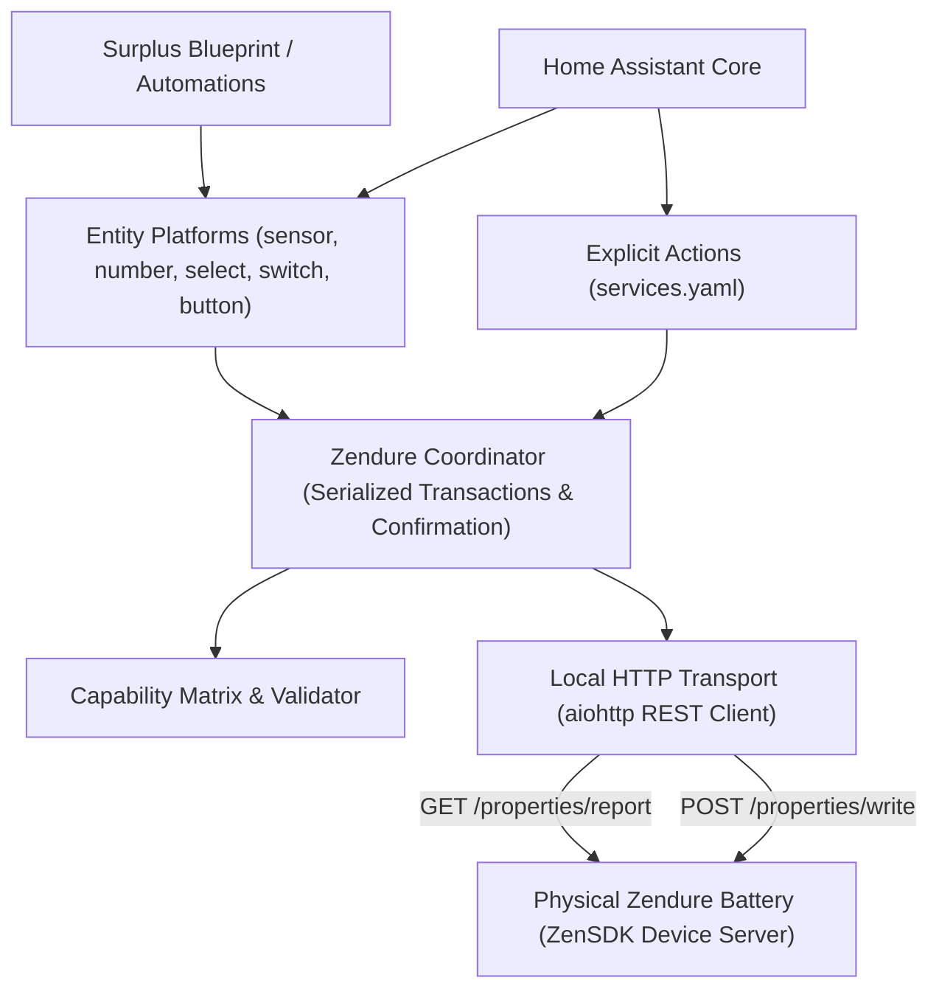

# Zendure Local Battery Control for Home Assistant (`zendure_local`)

A fast, reliable, local-first Home Assistant custom integration for Zendure battery systems (SolarFlow series, Hyper 2000).

## Philosophy

Unlike monolithic integrations that embed an energy optimizer, `zendure_local` focuses on doing one job exceptionally well:

> **Maintain a true, real-time model of the Zendure battery on your local network, and provide safe, explicit, transactional controls for charging, discharging, limits, and operating modes.**

Your energy management strategy (dynamic tariffs, solar forecasts, home surplus charging, grid peak shaving) lives where it belongs: in **Home Assistant Automations, Scripts, Helpers, or Blueprints**.

---

## Key Highlights

- **100% Local HTTP First**: Communicates directly over LAN with Zendure devices hosting the ZenSDK HTTP API (`GET /properties/report`, `POST /properties/write`). Zero cloud dependency for daily operation.
- **No Flash Wear (`smartMode`)**: Frequent automation writes (e.g. surplus regulation) write to volatile MCU memory by default (`smartMode: 1`), preventing NAND flash degradation.
- **Strict Write Confirmation**: Control entities reflect confirmed device state from readback verification, never optimistic requested state.
- **Robust Multi-Device Support**: Unique IDs incorporate hardware serial numbers (`zendure_local_<serial>_<property>`), completely preventing entity collisions for multiple identical units.
- **Stale & Offline Resilience**: Device dropouts do not wipe out last-known SOC or user settings. Retries use exponential backoff, and IP address changes trigger automatic rediscovery.
- **Solar Surplus Controller Blueprint**: Ships with an automation blueprint to dynamically balance home surplus with battery charge/discharge limits.

---

## Supported Devices & Capability Matrix

| Model | Transports | Max Charge (W) | Max Discharge (W) | Writable Properties |
|---|---|---|---|---|
| **SolarFlow 800** | Local HTTP | 800 W | 800 W | `inputLimit`, `outputLimit`, `acMode`, `socSet`, `minSoc`, `smartMode` |
| **SolarFlow 800 Plus** | Local HTTP | 800 W | 800 W | `inputLimit`, `outputLimit`, `acMode`, `socSet`, `minSoc`, `smartMode` |
| **SolarFlow 800 Pro** | Local HTTP | 800 W | 800 W | `inputLimit`, `outputLimit`, `acMode`, `socSet`, `minSoc`, `smartMode` |
| **SolarFlow 1600 AC+** | Local HTTP | 1600 W | 1200 W | `inputLimit`, `outputLimit`, `acMode`, `socSet`, `minSoc`, `smartMode` |
| **SolarFlow 2400 AC** | Local HTTP | 2400 W | 2400 W | `inputLimit`, `outputLimit`, `acMode`, `socSet`, `minSoc`, `smartMode` |
| **Hyper 2000** *(ZenSDK fw)* | Local HTTP | 2400 W | 2400 W | `inputLimit`, `outputLimit`, `acMode`, `socSet`, `minSoc`, `smartMode` |
| **SolarFlow 2400 AC+** | Local HTTP | 3200 W | 2400 W | `inputLimit`, `outputLimit`, `acMode`, `socSet`, `minSoc`, `smartMode` |
| **SolarFlow 2400 Pro** | Local HTTP | 3200 W | 2400 W | `inputLimit`, `outputLimit`, `acMode`, `socSet`, `minSoc`, `smartMode` |
| **SmartMeter 3CT** | Local HTTP | — | — | *Telemetry only (Read-Only)* |
| **Unknown Device** | Local HTTP | — | — | *Safe Read-Only Mode* |

---

## Architecture Overview

---

## Entities Provided

### Sensors
- **Battery SOC** (`%`)
- **Battery State** (`standby`, `charging`, `discharging`, `unknown`)
- **Solar Input Power** (`W`)
- **Home Output Power** (`W`)
- **Battery Charge Power** (`W`)
- **Battery Discharge Power** (`W`)
- **Grid Input Power** (`W`)
- **Target SOC Limit** (`%`)
- **Minimum SOC Limit** (`%`)
- **AC Charge Limit** (`W`)
- **Output Limit** (`W`)
- **Device Temperature** (`°C`)
- **Signal Strength / RSSI** (`dBm`)
- **Active Transport** (`local_http`, `local_mqtt`, `cloud`)
- **Command Status** (`idle`, `queued`, `sent`, `confirmed`, `failed`, `timed_out`)
- **Command Detail**
- *Optional per-PV channel sensors (`Solar Power PV1..6`)*
- *Optional per-pack sensors (SOC, temperature, power)*

### Binary Sensors
- **Device Available**
- **Data Stale** (triggered after 3 consecutive missed poll intervals)
- **Error Present**
- **Grid Connected**
- **Reverse Flow Active**
- **Local API Available**

### Controls
- **Charge Limit** (`number.charge_limit_setting`, 0 to max W)
- **Output Limit** (`number.output_limit_setting`, 0 to max W)
- **Target SOC Limit** (`number.target_soc_setting`, 70% to 100%)
- **Minimum SOC Limit** (`number.minimum_soc_setting`, 0% to 50%)
- **Operating Mode** (`select.operating_mode`: `charge` [1], `discharge` [2])
- **Volatile Write Mode** (`switch.volatile_write_mode`: `smartMode: 1`)
- **Buttons**: `Refresh Now`, `Rediscover Endpoint`, `Test Write Path`

### Services / Actions
- `zendure_local.set_charge_limit`: Sets AC charging limit (W)
- `zendure_local.set_output_limit`: Sets home output discharge limit (W)
- `zendure_local.set_mode`: Sets inverter mode (`charge` or `discharge`)
- `zendure_local.set_soc_limits`: Sets min SOC and target SOC
- `zendure_local.stop_output`: Sets output limit to 0W immediately
- `zendure_local.refresh`: Requests immediate status poll
- `zendure_local.rediscover`: Triggers mDNS rediscovery

---

## Installation & Setup

1. Copy `custom_components/zendure_local` into your Home Assistant `<config>/custom_components/` directory.
2. Restart Home Assistant.
3. If your device is on the local network, Home Assistant will automatically discover it via mDNS (`_zendure._tcp`).
4. Click **Configure** on the discovered device, or navigate to **Settings > Devices & Services > Add Integration** and search for **Zendure Local Battery Control**.
5. If setting up manually, enter the battery IP address and port (default: 80).

> [!IMPORTANT]
> **EN 18031 & HEMS Enablement**:
> On newer Zendure firmware complying with EN 18031, local HTTP API access requires enabling **HEMS** in the official Zendure mobile app:
> 1. Open the Zendure app and navigate to your device settings.
> 2. Enable **HEMS / Local API Mode**.
> 3. Fully close/exit the Zendure app to apply the configuration.

---

## Surplus Controller Blueprint

Import the blueprint from `blueprints/automation/surplus_controller.yaml`.

### Inputs:
- **Grid Power Sensor**: Select your home P1 / smart meter sensor.
- **Sign Convention**: Choose whether positive represents export or import.
- **Battery Entities**: Point to the battery SOC sensor, charge/discharge limits, and mode select.
- **Deadband & Limits**: Set power deadband (default 50W) and max charge/discharge bounds.

The blueprint automatically routes excess solar power into the battery and discharges stored solar power during home deficits, while respecting min/max SOC thresholds and preventing flash wear.
