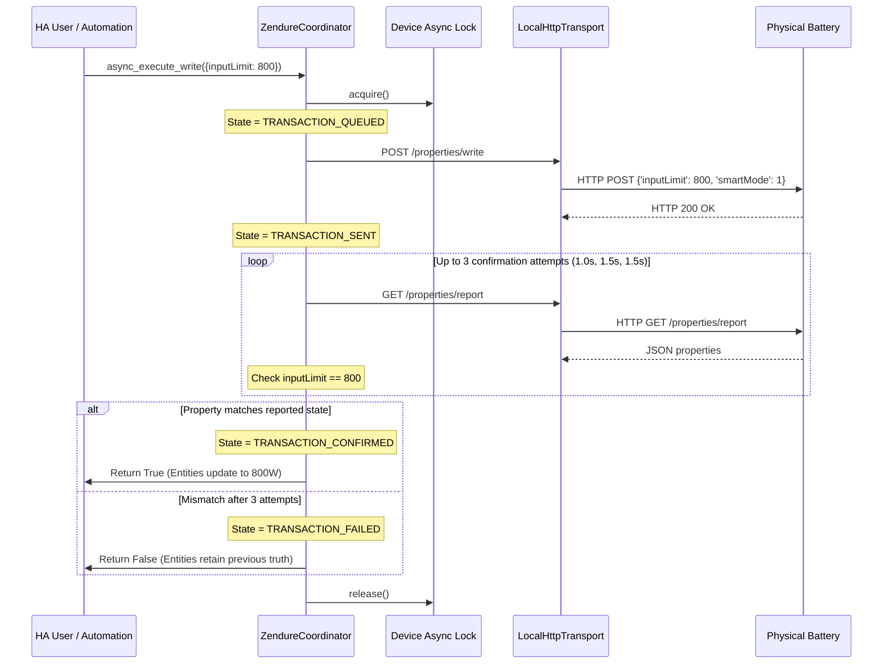

# Zendure Local Battery Control: Architecture & Design

This document details the architectural principles, data flow, safety models, and hardware interfaces powering `zendure_local`.

---

## 1. Core Architectural Philosophy

### Separation of Concerns
```
+-------------------------------------------------------------+
| Home Assistant Energy Strategies & Automations              |
| (Solar Forecast, Dynamic Tariffs, P1 Surplus Controller)     |
+-------------------------------------------------------------+
                              |
                              v
+-------------------------------------------------------------+
| zendure_local Integration (Pure Model & Transaction Layer)  |
| - Truthful device state reflection                          |
| - Serialized write transactions with confirmation           |
| - Zero flash wear protection (smartMode: 1)                 |
| - Range validation and capability matrix                    |
+-------------------------------------------------------------+
                              |
                              v
+-------------------------------------------------------------+
| Physical Zendure Battery (ZenSDK HTTP REST Server)          |
| GET /properties/report  |  POST /properties/write            |
+-------------------------------------------------------------+
```

Traditional integrations often embed an energy manager inside the integration itself. This leads to rigid logic, hidden state transitions, race conditions, and difficulty integrating with existing Home Assistant automations.

`zendure_local` adheres to the Unix philosophy: **do one job exceptionally well**.
1. Maintain an accurate, normalized model of the Zendure battery.
2. Provide safe, transactional, confirmed controls.
3. Delegate all automation, strategy, and balancing to Home Assistant automations and blueprints.

---

## 2. ZenSDK Local HTTP Transport

Zendure batteries equipped with ZenSDK firmware (SolarFlow 800, 1600 AC+, 2400 AC, Hyper 2000, 2400 AC+, 2400 Pro) host an embedded HTTP server on local port 80.

### 2.1 State Reporting (`GET /properties/report`)
- Returns a JSON payload containing device hardware metadata, current operating state, and battery pack telemetry.
- Polled periodically by `ZendureCoordinator` (default: every 10 seconds).
- Response time is exceptionally fast over local Wi-Fi: **20ms – 40ms**.

### 2.2 Property Writing (`POST /properties/write`)
- Payload format:
  ```json
  {
    "properties": {
      "acMode": 1,
      "inputLimit": 500,
      "smartMode": 1
    }
  }
  ```
- All writes are executed over HTTP keep-alive sessions with connection timeouts (3.0s) and read timeouts (5.0s).

---

## 3. Flash Wear Prevention (`smartMode: 1`)

### The Hardware Risk
Writing configuration to embedded microcontrollers often commits values to EEPROM or NAND flash memory. Flash memory cells endure typically 10,000 to 100,000 write cycles before permanent physical degradation. Frequent writes from automated solar surplus regulations (e.g. updating limits every 10–30 seconds) would destroy device flash within months.

### The Solution: Volatile MCU RAM Writes
When `smartMode: 1` is supplied in `POST /properties/write`:
- The MCU applies the power limits and mode changes directly into **active volatile RAM**.
- The physical flash memory is **never touched**.
- Power limits take effect immediately.
- If the unit loses power or restarts, it reloads its baseline non-volatile settings from flash.

`zendure_local` automatically injects `smartMode: 1` into all automation writes by default. Users can toggle persistent/volatile modes via `switch.volatile_write_mode` or the options flow.

---

## 4. Transaction Lifecycle & Readback Confirmation

Home Assistant entities in `zendure_local` never optimistically pretend a write succeeded before the battery actually accepts and applies it.



### Confirmation Grace Window
Physical inverters take between 0.8s and 2.5s to switch internal relay states and update their RAM report buffer. `ZendureCoordinator` uses a multi-attempt confirmation loop (initial delay of 1.0s, followed by up to 2 retry attempts with 1.5s delay) before verifying match.

---

## 5. Multi-Device Identity & Collision Prevention

To ensure multiple identical Zendure units (e.g. two SolarFlow 2400 AC+ units on the same property) coexist without entity ID collisions:

- **Device Identifier**: Formatted as `(DOMAIN, serial)` using the hardware serial number (`sn`) extracted from firmware reports.
- **Entity Unique ID**:
  ```python
  self._attr_unique_id = f"zendure_local_{coordinator.serial}_{key}"
  ```
  Example: `zendure_local_HEC4NENCN490106_charge_limit_setting`
- Model names are never used as identifiers.

---

## 6. Real-Hardware Property Conversions

| Property | Raw Representation | Normalized Representation | Formula |
|---|---|---|---|
| **Temperature** (`hyperTmp`, `maxTemp`) | 0.1 Kelvin (`3081`) | Degrees Celsius (`35.0 °C`) | `(raw - 2731) / 10.0` |
| **Current** (`batcur`) | 16-bit 2's complement, 0.1A | Amperes (`A`) | `signed_int16(raw) / 10.0` |
| **Pack Voltage** (`totalVol`, `BatVolt`) | Centivolts (`4790`) | Volts (`47.90 V`) | `raw / 100.0` if `raw > 500` else `raw` |
| **Cell Voltage** (`maxVol`, `minVol`) | Centivolts (`321`) | Volts (`3.21 V`) | `raw / 100.0` |
| **Target SOC** (`socSet`) | 0.1% factor (`1000`) or `%` (`100`) | Percent (`100%`) | `round(raw / 10)` if `raw > 100` else `raw` |
| **Min SOC** (`minSoc`) | 0.1% factor (`100`) or `%` (`10`) | Percent (`10%`) | `round(raw / 10)` if `raw > 50` else `raw` |
